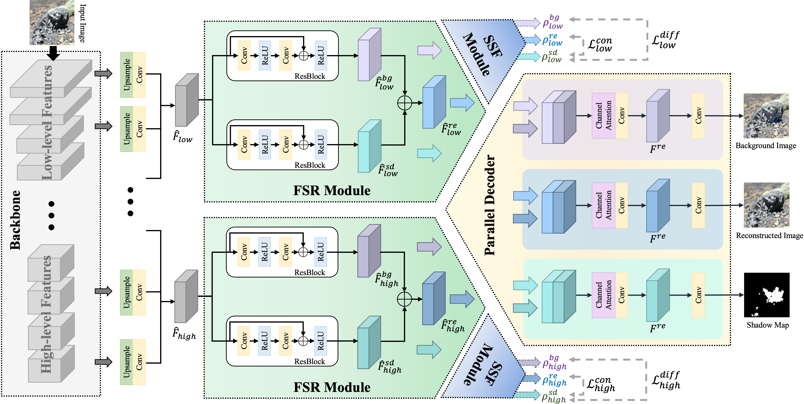
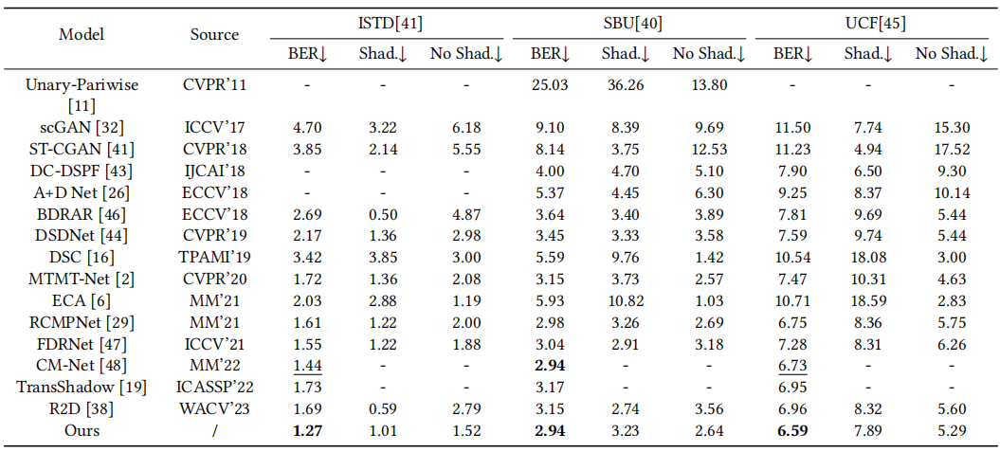

# SDDNet_ACMMM23

Runmin Cong, Yuchen Guan, Jinpeng Chen, Wei Zhang, Yao Zhao, and Sam Kwong, SDDNet: Style-guided dual-layer disentanglement network for shadow detection, ACM Multimedia (ACM MM), 2023. In Press.

## Network

### Our overall framework：




## Requirement

Pleasure configure the environment according to the given version:

- python 3.6.10
- pytorch 1.10.1
- cudatoolkit 11.1
- torchvision 0.11.2
- tensorboard 2.3.0
- opencv-python 3.4.2
- PIL 7.2.0
- pydensecrf 1.0rc3
- numpy 1.18.5

We also provide ".yaml" files for conda environment configuration, you can  use `conda env create -f env.yaml` to create a required environment.

ResNext101 has been adopted, please put `resnext_101_32x4d.pth` in the `SDDNet/resnext` directory. You can download the model from [[Link](https://pan.baidu.com/s/12aR793_GeohinDlFbqGlzQ)], code: ```mvpl```.


## Preparation

 Please follow this structure to inspect the code:


```python
├── ISTD_Dataset
    ├── test
    ├── train
├── SBU-shadow
    ├── SBU-Test_rename
    ├── SBUTrain4KRecoveredSmall
├── UCF
    ├── train_A
    ├── train_B
├── SDDNet
    ├── ckpt
    ├── datasets
    ├── logs
    ├── networks
    ├── resnext
    ├── test
    ├── utils
    ├── crf_refine.py
    ├── modelsize_estimate.py
    ├── test.py
    ├── train.py
```


## Training and Testing

**Please Note** :
The input images folder is always named 'train_A' and the GT folder is always named 'train_B' for uniform processing.

**Training command** :
```python
python train.py
```

**Testing command** :
The trained model for SDDNet can be download here: [[Baidu Netdisk Link](https://pan.baidu.com/s/1OyFuHeWtfiueOUan9GxQrg)], code: ```mvpl``` or [[Google Drive Link](https://drive.google.com/drive/folders/1Qz7zPT1A4u1OO6t8v6AiySBMBK9rBZLb?usp=sharing)].
```python
python test.py
python crf_refine.py
```

<!-- ## Evaluation
We implement the widely-used metric, balanced error rate (BER). -->
## Results

1. **Qualitative results**: we provide the saliency maps, you can download them from [[Baidu Netdisk Link](https://pan.baidu.com/s/1-wvG-LVGIu4HEiP1izs_ZQ)], code: ```mvpl``` or [[Google Drive Link](https://drive.google.com/drive/folders/1Qz7zPT1A4u1OO6t8v6AiySBMBK9rBZLb?usp=sharing)].
2. **Quantitative results**: 




<!-- ## Bibtex
```
   @article{HybridSOD,
     title={A weakly supervised learning framework for salient object detection via hybrid labels},
     author={Cong, Runmin and Qin, Qi and Zhang, Chen and Jiang, Qiuping and Wang, Shiqi and Zhao, Yao and Kwong, Sam },
     journal={IEEE Trans. Circuits Syst. Video Technol. },
     year={early access, doi: 10.1109/TCSVT.2022.3205182},
     publisher={IEEE}
    }
  
``` -->
## Contact Us
If you have any questions, please contact Runmin Cong at [rmcong@sdu.edu.cn](mailto:rmcong@sdu.edu.cn) or Yuchen Guan at [yuchenguan@bjtu.edu.cn](mailto:19281155@bjtu.edu.cn).

